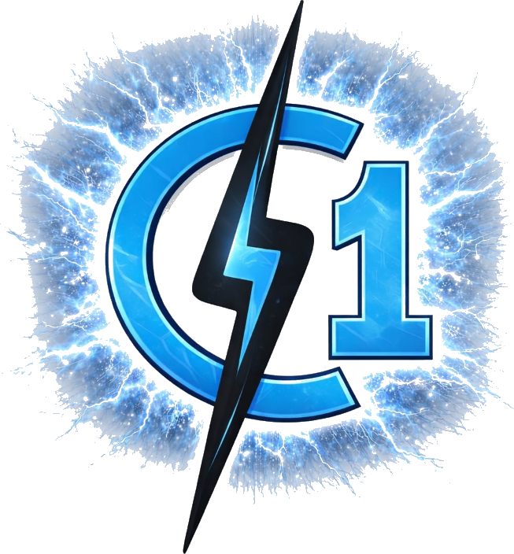

# CrackOne - Software Development & Cloud Solutions



A professional, modern company website built with React.js, Node.js, Express.js, and MySQL.

## 🚀 Features

- **Modern UI/UX** - Electric blue theme with animations and glassmorphism
- **Responsive Design** - Works on all devices
- **React Frontend** - Fast SPA with React Router
- **Node.js Backend** - RESTful API with Express
- **MySQL Database** - Structured data storage
- **Admin Dashboard** - Manage contacts and content

## 📁 Project Structure

```
CrackOne/
├── client/                 # React Frontend
│   ├── src/
│   │   ├── components/     # Navbar, Footer
│   │   ├── pages/          # Home, About, Services, Portfolio, Contact, Admin
│   │   ├── App.jsx
│   │   └── index.css       # Global styles
│   ├── package.json
│   └── vite.config.js
│
├── server/                 # Node.js Backend
│   ├── config/db.js        # MySQL connection
│   ├── routes/             # API endpoints
│   │   ├── services.js
│   │   ├── portfolio.js
│   │   ├── contact.js
│   │   ├── testimonials.js
│   │   └── auth.js
│   ├── database/schema.sql # Database schema
│   ├── index.js            # Server entry
│   ├── .env                # Environment variables
│   └── package.json
│
└── README.md
```

## 🛠️ Installation

### Prerequisites
- Node.js (v18 or higher)
- MySQL (v8 or higher)
- npm or yarn

### 1. Clone/Setup Project

```bash
cd c:\Users\ELCOT\OneDrive\Desktop\CrackOne
```

### 2. Setup Database

```sql
-- Run in MySQL
CREATE DATABASE crackone_db;
SOURCE server/database/schema.sql;
```

### 3. Configure Environment

Edit `server/.env` with your MySQL credentials:

```env
DB_HOST=localhost
DB_USER=root
DB_PASSWORD=your_password
DB_NAME=crackone_db
```

### 4. Install Dependencies

```bash
# Install frontend dependencies
cd client
npm install

# Install backend dependencies
cd ../server
npm install
```

### 5. Run the Application

```bash
# Terminal 1 - Start Backend
cd server
npm run dev

# Terminal 2 - Start Frontend
cd client
npm run dev
```

Visit: http://localhost:5173

## 📡 API Endpoints

| Endpoint | Method | Description |
|----------|--------|-------------|
| `/api/services` | GET | Get all services |
| `/api/portfolio` | GET | Get all projects |
| `/api/contact` | POST | Submit contact form |
| `/api/testimonials` | GET | Get testimonials |
| `/api/auth/login` | POST | Admin login |

## 🎨 Pages

- **Home** - Hero, services, stats, testimonials, CTA
- **About** - Company story, team, timeline, values
- **Services** - All 12 services with filtering
- **Portfolio** - Case studies with outcomes
- **Contact** - Working form with validation
- **Admin** - Dashboard for content management

## 💻 Tech Stack

| Layer | Technology |
|-------|------------|
| Frontend | React.js, Vite, React Router |
| Styling | CSS3, Animations, Glassmorphism |
| Backend | Node.js, Express.js |
| Database | MySQL |
| Auth | JWT, bcryptjs |

## 📞 Contact

CrackOne - Software Development & Cloud Solutions

---

Built with ⚡ by CrackOne Team
